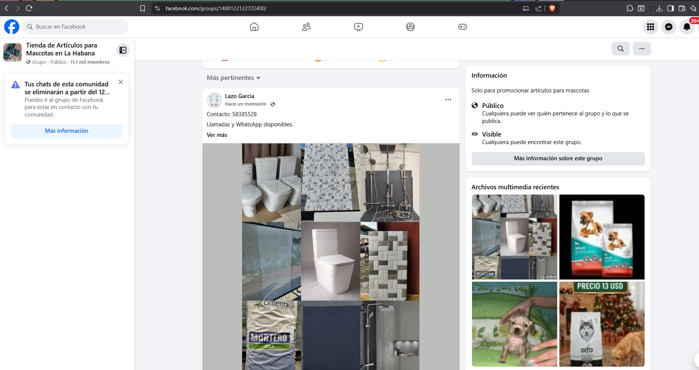
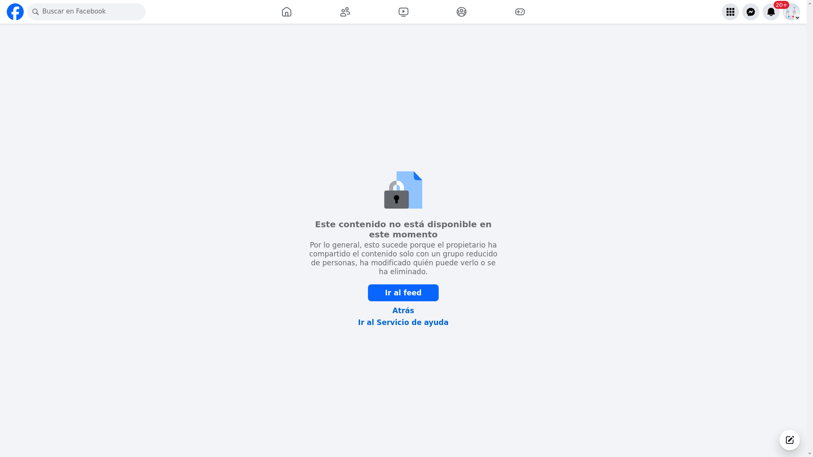

Dec 21, 4:19 PM      

Hola Yariel,       

Ya te envío el archivo completo y corregido playwright_utils.py.     

Esta versión ya no tiene errores de sintaxis, carga correctamente en Django/Celery y mantiene todas las funciones del módulo, con los ajustes que comentamos (timezone Cuba y verificación post-publicación).       

Por favor:       

- Reemplaza el archivo completo por este.
- Reinicia los workers de Celery.
- Prueba una o dos publicaciones como hiciste antes.

Si aparece algún error nuevo, envíame solo la línea clave del error (la que indica archivo y número de línea) y lo revisamos de forma puntual.        

Quedo atento a tus pruebas.       

playwright_utils_v4.py     (48.9 kB)       

 

yariel537     Dec 21, 6:02 PM       

Aparece como DESCONOCIDO pero el anuncio fue correctamente publicado       

 

image(11).png     (13.21 kB)        

.png "image(11),png")        

 

image(12).png     (827.92 kB)       

       

 

yariel537     Dec 21, 6:03 PM     

1 archivo     paso5_estado_DESCONOCIDO.png     (371.26 kB)       
        

       

 

yariel537     Dec 21, 6:04 PM       

Me sigue dando errores en el task.py       

 

image(14).png     (48.58 kB)       

 

.png "image(14).png")       

 

yariel537     Dec 21, 6:21 PM     

Me dio este error que nunca me habia ocurrido, me llevo a esta URL       

 

error_1_1766359156.png     (66.21 kB)       

 

       

 
 

yariel537     Dec 21, 7:03 PM     
no se fije en este ultimo error del feed, el problema fue que me expulsaron de ese grupo con el usuario que estaba publicando
